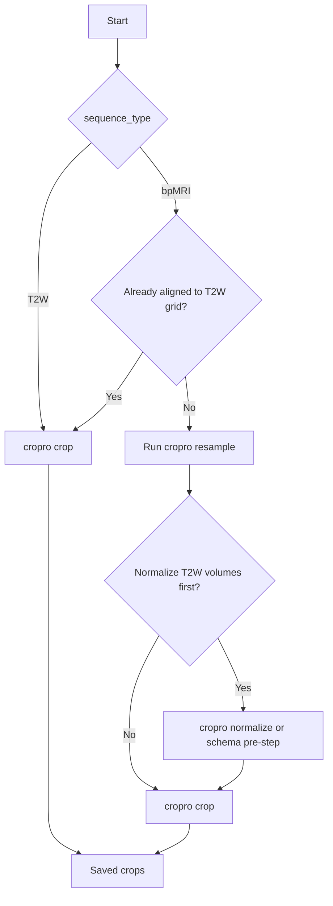

# CROPro

CROPro prepares prostate MRI data for AI workflows.

It supports full-dataset download, resampling, normalization, and cropping for:

- T2W-only workflows
- bpMRI workflows (T2W + ADC + HBV)
- Negative, positive, and unknown patient groups

If you use CROPro, please cite the paper in the Citation section.

## What Matters Most

- One CLI with 4 pipelines: `download`, `resample`, `normalize`, `crop`
- Dataset-agnostic core with optional local dataset plugins
- Batch workflows and per-case workflows
- Automatic bpMRI alignment checks to prevent misaligned crops

## Install

Requirements:

- Python 3.13+

Install in a project:

```bash
uv add cropro
```

Or install as a standalone CLI:

```bash
uv tool install cropro
```

From this repository, run commands with `uv run`.

## Quick Start (Generic)

1. Download data:

```bash
cropro download --dataset mydataset --url https://host/path/dataset.zip
```

2. Resample dataset to align ADC/HBV and masks to each T2W grid:

```bash
cropro resample --schema config/pipeline.toml
```

3. Crop dataset:

```bash
cropro crop --schema config/pipeline.toml
```

## Pipelines

| Pipeline | Command | Use it when |
| --- | --- | --- |
| Download | `cropro download` | You want CROPro to fetch archives from URLs or a local dataset plugin. |
| Resample | `cropro resample` | You need spatially aligned bpMRI data before cropping. |
| Normalize | `cropro normalize` | You want to normalize full T2W datasets in place or to a new folder. |
| Crop | `cropro crop` | You want model-ready crops from a case or a dataset. |

`cropro` without subcommand defaults to `crop` for backward compatibility.

### Pipeline Decision Guide

For bpMRI workflows, **alignment to T2W is required** before cropping ADC/HBV together with T2W. Choose one:

1. **Resample first (recommended)** — run `cropro resample` once to write aligned copies of the whole database, then crop those.
2. **On-the-fly during cropping** — pass `--resample_bpmri_to_t2w true` to align each case as you crop (no extra files written).

If neither is enabled and bpMRI volumes are misaligned, crop stops with a clear message instead of producing wrong crops.


```mermaid
flowchart TD
  A[Start] --> B{sequence_type}
  B -->|T2W| C[cropro crop]
  B -->|bpMRI| D{Already aligned to T2W grid?}
  D -->|Yes| C
  D -->|No| E[Run cropro resample]
  E --> F{Normalize T2W volumes first?}
  F -->|Yes| G[cropro normalize or schema pre-step]
  F -->|No| H[cropro crop]
  G --> H
  C --> I[Saved crops]
  H --> I
```

## Most Useful Commands

```bash
cropro --help
cropro download --help
cropro resample --help
cropro normalize --help
cropro crop --help
```

Download a dataset from URL(s):

```bash
cropro download --dataset mydataset --url https://host/path/dataset.zip
```

Crop a whole folder (batch mode):

```bash
cropro crop \
  --images-root dataset/MyDataset/images_resampled \
  --output-root dataset/cropro/MyDataset/stride_0.4_128 \
  --sequence_type bpMRI \
  --crop_method stride \
  --pixel_spacing 0.4 \
  --crop_image_size 128 \
  --crop_stride 32 \
  --saved_image_type png
```

Normalize all T2W volumes in a dataset:

```bash
cropro normalize \
  --images-root dataset/MyDataset/images_resampled \
  --method autoref
```

## Python API

### Crop a Single Case

Negative or unknown case:

```python
from cropro import CROPro, CropConfig

config = CropConfig(
    crop_method="stride",
    patient_status="negative",
    sequence_type="T2W",
    orig_img_path_t2w="data/patient_001/t2w.nii.gz",
    seg_img_path="data/patient_001/prostate_gland_mask.nii.gz",
    pixel_spacing=0.4,
    crop_image_size=128,
    crop_stride=32,
    saved_image_type="png",
    path_to_save="outputs/patient_001",
)

CROPro(config).run()
```

Positive case:

```python
from cropro import CROPro, CropConfig

config = CropConfig(
    crop_method="stride",
    patient_status="positive",
    sequence_type="T2W",
    orig_img_path_t2w="data/patient_002/t2w.nii.gz",
    seg_img_path="data/patient_002/prostate_gland_mask.nii.gz",
    seg_img_path_lesion="data/patient_002/lesion_mask.nii.gz",
    tumor_label_level=1,
    c_min_positive=0.2,
    pixel_spacing=0.4,
    crop_image_size=128,
    crop_stride=32,
    saved_image_type="png",
    path_to_save="outputs/patient_002",
)

CROPro(config).run()
```

bpMRI case:

```python
from cropro import CROPro, CropConfig

config = CropConfig(
    crop_method="center",
    patient_status="negative",
    sequence_type="bpMRI",
    orig_img_path_t2w="data/patient_003/t2w.nii.gz",
    orig_img_path_adc="data/patient_003/adc.nii.gz",
    orig_img_path_hbv="data/patient_003/hbv.nii.gz",
    seg_img_path="data/patient_003/prostate_gland_mask.nii.gz",
    pixel_spacing=0.5,
    crop_image_size=128,
    saved_image_type="png",
    path_to_save="outputs/patient_003",
)

CROPro(config).run()
```

## Inputs (Minimal)

- Negative/Unknown case:
  - T2W image
  - Gland mask
- Positive case:
  - T2W image
  - Gland mask
  - Lesion mask
- bpMRI case:
  - T2W image
  - ADC image
  - HBV image
  - Required masks based on status above

Supported image formats are those readable by SimpleITK (for example `.mha`, `.nii`, `.nii.gz`).

## Schema Files

Use schema files to keep paths and defaults in one place:

- `config/pipeline.toml` (generic template)

You can override schema values with CLI flags.

### Local Dataset Plugins (Git-Ignored)

CROPro is dataset-agnostic in committed code. Put dataset-specific behavior in:

- `.cropro_user/dataset_plugins.py` (git-ignored)

Plugins can define:

- resample layout defaults (suffixes, mask roots)
- custom download logic (URLs, folds, labels repo, auth flow)

Use plugin names from CLI:

```bash
cropro resample --dataset-plugin mydataset --schema config/my_dataset.toml
cropro download --dataset mydataset --dataset-plugin mydataset
```

### How To Add A Dataset Plugin

Create a file at `.cropro_user/dataset_plugins.py` (this folder is git-ignored) and define a class that inherits from `DatasetPlugin`.

Minimal example:

```python
from pathlib import Path

from cropro.datasets import DatasetPlugin
from cropro.download import download_from_urls


class MyDatasetPlugin(DatasetPlugin):
  name = "mydataset"

  def apply_resample_defaults(self, *, images_root: Path, layout, options: dict) -> None:
    # Optional defaults used by `cropro resample` when values are not
    # explicitly provided in schema/CLI.
    layout.t2w_suffix = "_t2w.mha"
    layout.adc_suffix = "_adc.mha"
    layout.hbv_suffix = "_hbv.mha"
    layout.mask_suffix = ".nii.gz"
    layout.gland_root = images_root.parent / "labels" / "gland"
    layout.lesion_root = images_root.parent / "labels" / "lesion"

  def download(self, *, config, urls: list[str], folds: list[str], skip_labels: bool) -> bool:
    # Optional custom download behavior.
    # If you return False, CROPro falls back to generic --url downloading.
    if not urls:
      urls = ["https://host.example.org/path/to/mydataset.zip"]
    download_from_urls(config, urls=urls)
    return True


PLUGINS = [MyDatasetPlugin()]
```

Optional: if your plugin file is not at `.cropro_user/dataset_plugins.py`, set:

```bash
# Windows PowerShell
$env:CROPRO_DATASET_PLUGIN_FILE = "C:/path/to/dataset_plugins.py"
```

You can also bind a schema to a plugin:

```toml
[dataset]
name = "MyDataset"
plugin = "mydataset"
```

Run with plugin examples:

```bash
# 1) Download via plugin handler
cropro download --dataset mydataset --dataset-plugin mydataset

# 2) Resample using plugin defaults + schema overrides
cropro resample --schema config/my_dataset.toml --dataset-plugin mydataset

# 3) Crop the dataset
cropro crop --schema config/my_dataset.toml --images-root dataset/MyDataset/images_resampled
```

### Creating a Custom Schema

A schema describes your dataset layout, naming conventions, and default crop settings in one TOML file:

```toml
# config/my_dataset.toml

[dataset]
name = "MyDataset"

[paths]
images_root  = "dataset/MyDataset/images"
output_root  = "dataset/MyDataset/images_resampled"
gland_root   = "dataset/MyDataset/masks/gland"
lesion_root  = "dataset/MyDataset/masks/lesion"
archives_root = "none"
cropro_root  = "dataset/MyDataset/cropped_images"

[naming]
t2w_suffix  = "_t2w.nii.gz"
adc_suffix  = "_adc.nii.gz"
hbv_suffix  = "_hbv.nii.gz"
mask_suffix = ".nii.gz"

[crop]
sequence_type    = "bpMRI"
pixel_spacing    = 0.4
crop_image_size  = 128
crop_stride      = 32
crop_method      = "random"
saved_image_type = "png"

[split]
enabled       = true
train_ratio   = 0.70
val_ratio     = 0.15
test_ratio    = 0.15
split_level   = "patient"
```

Use the schema with any pipeline:

```bash
cropro resample --schema config/my_dataset.toml
cropro crop --schema config/my_dataset.toml
```

CLI flags always override schema values.

Archive auto-unpacking: if you have `*.zip` files in `<images-root>/../archives`, the resample pipeline automatically unpacks them before aligning.

## Output

Crops are written to your selected output directory (`--path_to_save` for single-case mode, or `--output-root` for batch mode).

For schema-based runs, outputs are typically organized under each schema `cropro_root` path.

## Troubleshooting

- If bpMRI crop fails with an alignment message, run `cropro resample` first.
- If no crops are saved for positive cases, verify lesion label values and `--tumor_label_level`.
- If running from source and imports fail, run `uv sync` (or `uv sync --extra dev` for contributor tools).

## Development

Install project dependencies:

```bash
uv sync --extra dev
```

Run checks:

```bash
uv run ruff check .
uv run pytest
```

## Citation

```bibtex
@article{10.1117/1.JMI.10.2.024004,
  author = {Alexandros Patsanis and Mohammed R. S. Sunoqrot and Tone F. Bathen and Mattijs Elschot},
  title = {{CROPro: a tool for automated cropping of prostate magnetic resonance images}},
  volume = {10},
  journal = {Journal of Medical Imaging},
  number = {2},
  publisher = {SPIE},
  pages = {024004},
  year = {2023},
  doi = {10.1117/1.JMI.10.2.024004},
  url = {https://doi.org/10.1117/1.JMI.10.2.024004}
}
```

## License

**CC BY-NC 4.0** (Creative Commons Attribution-NonCommercial 4.0 International)

CROPro is for **research and educational use only**. Commercial use is prohibited.

You are free to use, modify, and distribute CROPro for non-commercial purposes with proper attribution. 

See `LICENSE` for full terms. Dataset licenses may vary by source and must be reviewed separately.

---

## Detailed Reference

### Configuration Reference

These variables are accepted by the Python `CropConfig` class and by CLI arguments with the same names.

| Setting | Default | Meaning |
| --- | --- | --- |
| `crop_method` | `center` | Crop strategy: `center`, `random`, or `stride`. |
| `orig_img_path_t2w` | `None` | T2W image path. Required for all workflows. |
| `orig_img_path_adc` | `None` | ADC image path. Required when `sequence_type="bpMRI"`. |
| `orig_img_path_hbv` | `None` | HBV image path. Required when `sequence_type="bpMRI"`. |
| `seg_img_path` | `None` | Prostate gland segmentation mask path. Required for negative, unknown, and positive workflows. |
| `seg_img_path_lesion` | `None` | Lesion segmentation mask path. Required for positive patients unless the gland mask already contains lesion labels. |
| `prostate_gland_seg_contains_lesion` | `False` | Set to `True` when `seg_img_path` contains both gland and lesion labels. |
| `tumor_label_level` | `2` | Label value used for lesion pixels. Use `1` if your lesion mask stores lesions as label `1`. |
| `patient_status` | `negative` | `negative`, `positive`, or `unknown`. |
| `pixel_spacing` | `0.5` | Target in-plane spacing in millimeters per pixel before cropping. |
| `crop_image_size` | `128` | Output crop width and height in pixels. |
| `sample_number` | `12` | Number of random crops to try when `crop_method="random"`. |
| `crop_stride` | `32` | Step size in pixels when `crop_method="stride"`. |
| `sequence_type` | `T2W` | `T2W` for T2W-only crops, or `bpMRI` for T2W/ADC/HBV crops. |
| `t2w_normalization_method` | `autoref` | Normalization strategy for T2W: `percentile`, `autoref`, `gaussian`, or `zscore_clip`. |
| `adc_normalization_method` | `percentile` | Normalization strategy for ADC: `percentile`, `gaussian`, or `zscore_clip`. |
| `hbv_normalization_method` | `percentile` | Normalization strategy for HBV: `percentile`, `gaussian`, or `zscore_clip`. |
| `t2w_min_percentile` | `0.5` | T2W-specific lower percentile for clipping/windowing. |
| `t2w_max_percentile` | `99.5` | T2W-specific upper percentile for clipping/windowing. |
| `adc_min_percentile` | `0.5` | ADC-specific lower percentile for clipping/windowing. |
| `adc_max_percentile` | `99.5` | ADC-specific upper percentile for clipping/windowing. |
| `hbv_min_percentile` | `0.5` | HBV-specific lower percentile for clipping/windowing. |
| `hbv_max_percentile` | `99.9` | HBV-specific upper percentile for clipping/windowing. |
| `saved_image_type` | `tiff` | Output type: `png`, `jpg`, `jpeg`, `tiff`, `tif`, `npy`, `nmp`, or `npm` (`nmp`/`npm` map to `npy`). |
| `path_to_save` | `save_crop` | Output directory. |
| `c_min_positive` | `0.2` | Minimum lesion overlap required for saving a positive crop. |
| `c_min_negative` | `1` | Minimum gland coverage rule used by negative crop selection. |
| `keep_all_slice` | `True` | Keep all selected slices instead of applying slice filtering. |
| `random_seed` | `None` | Optional integer seed for deterministic random crop sampling. |

### Aligning ADC/HBV to T2W (bpMRI)

In many datasets, T2W, ADC and HBV sequences are acquired independently and can differ in slice count and in-plane size/spacing. Since CROPro crops all three at the same slice index and `(x, y)` origin, a mismatch can produce misaligned crops or an `IndexError`.

By default the crop pipeline **checks** that ADC and HBV are aligned to T2W before it starts. If they are not, it stops with a clear message instead of producing misaligned crops, and points you to the two ways of fixing it:

- **Resample pipeline (recommended)** — run `cropro resample` once to write aligned copies of the whole database, then crop those.

  ```bash
  cropro resample --images-root dataset/MyDataset/images --output-root dataset/MyDataset/images_resampled
  ```

  This writes the resampled ADC/HBV files for every case into a new `dataset/MyDataset/images_resampled` folder. Omit `--output-root` to write the aligned copies next to the originals with a `_to_t2w` suffix instead.

- **On-the-fly during cropping** — pass `--resample_bpmri_to_t2w true`. CROPro then resamples each ADC/HBV volume onto the T2W grid as it loads them (no extra files written) and the alignment check is skipped.

### Per-modality Normalization

Different sequences benefit from different normalization strategies. T2W has no fixed quantitative meaning and works well with `autoref` (AutoRef fat/muscle reference normalization) or `gaussian`, while ADC and HBV are better kept on a robust percentile window.

Override any sequence to mix methods in a single run:

```bash
cropro crop --do_normalization true \
  --t2w_normalization_method autoref \
  --adc_normalization_method percentile \
  --hbv_normalization_method percentile ...
```

### Dataset Splitting

CROPro includes a patient-level dataset splitter that divides cases into **train / validation / test** subsets and generates crops with the appropriate strategy for each.

Splitting is always at the **patient level** so that all crops from the same patient end up in a single subset and there is no data leakage.

#### Split Strategies

| Subset | Recommended crop method | Reason |
| --- | --- | --- |
| **Train** | `random` (or `center`) | Stochastic sampling gives data augmentation and exposes the model to varied prostate sub-regions per slice. |
| **Validation** | `stride` | Covers the entire prostate area on every slice without gaps, which is required for patient-level scoring. |
| **Test** | `stride` | Same reason as validation — complete coverage is mandatory for fair patient-level evaluation. |

#### Split Configuration

The `split_level` option controls which **slices** are included when generating crops for each subset:

| Level | What is included |
| --- | --- |
| `"patient"` (default) | Every slice that contains the prostate gland mask is cropped. **Required for patient-level inference.** |
| `"lesion"` | Only lesion-containing slices (positive cases) or central gland slices (negative cases). Useful for slice/image-level training. |

### Project Structure

```text
CROPro/
  src/cropro/              # Python package
    cropping/              # Cropping implementation
    cli.py                 # Command-line interface
    config.py              # CropConfig dataclass
    core.py                # CROPro runner
  examples/                # Runnable examples
  tests/                   # Tests
  config/                  # Runtime configuration
  pyproject.toml           # Package metadata and tooling config
```

### Development Checklist

Install development dependencies:

```bash
uv sync --extra dev
```

Run validation:

```bash
uv run ruff check .
uv run pytest
uv run python -m compileall src main.py examples tests
```
