# CROPro

CROPro is a Python package for automated cropping of prostate MRI volumes. It was developed for prostate MR preprocessing workflows where a model or reviewer needs consistent image patches around the prostate gland or clinically significant prostate cancer lesions.

The package supports:

- `center`, `random`, and `stride` crop strategies
- T2W-only and bpMRI cropping workflows
- negative, positive, and unknown patient-status workflows
- configurable in-plane resampling through `pixel_spacing`
- Python API and command-line usage

If you use CROPro in research, please cite the paper listed in [Citation](#citation):
`CROPro: a tool for automated cropping of prostate magnetic resonance images`.

## Contents

- [Installation](#installation)
- [Quick Start](#quick-start)
- [Input Data](#input-data)
- [Patient Workflows](#patient-workflows)
- [Visual Examples](#visual-examples)
- [Pixel Spacing](#pixel-spacing)
- [PI-CAI Dataset Setup](#pi-cai-dataset-setup)
- [Command Line](#command-line)
- [Configuration Reference](#configuration-reference)
- [Development](#development)
- [PyPI Release](#pypi-release)
- [Citation](#citation)

## Installation

This repository uses [`uv`](https://docs.astral.sh/uv/) for dependency management.

Install `uv` if needed:

```bash
curl -LsSf https://astral.sh/uv/install.sh | sh
```

Clone the repository and install the environment:

```bash
git clone https://github.com/alexofficial/CROPro.git
cd CROPro
uv sync
```

Check that the CLI is available:

```bash
uv run cropro --help
```

For development tools such as tests and linting:

```bash
uv sync --extra dev
```

When CROPro is published to PyPI, users will be able to install it in a project with:

```bash
uv add cropro
```

For CLI-only use after PyPI publication:

```bash
uv tool install cropro
cropro --help
```

## PyPI Release

This repository is configured to publish to PyPI through GitHub Actions using Trusted Publishing.

### One-Time Setup

1. On PyPI, create a project named `cropro` (or claim it if it already exists under your account).
2. In PyPI project settings, configure a Trusted Publisher for this GitHub repository and workflow:
  - owner/repo: `alexofficial/CROPro`
  - workflow filename: `.github/workflows/pypi-publish.yml`
  - environment: `pypi`

### Release Flow

1. Update version in `pyproject.toml`.
2. Commit and push to `main`.
3. Create a GitHub release (for example tag `v0.1.1`).
4. The `Publish to PyPI` workflow builds the package and uploads it to PyPI.

### Optional Local Validation

```bash
python -m build
python -m twine check dist/*
```

## Quick Start

### Crop A Negative Or Unknown Case

Use this when you have a T2W image and a prostate gland mask. For `unknown` patient status, CROPro uses the same gland-mask workflow as `negative`, which is useful for inference or review cases where cancer status is not known yet.

```python
from cropro import CROPro, CropConfig

config = CropConfig(
    crop_method="stride",
    patient_status="negative",  # "negative" or "unknown"
    sequence_type="T2W",
    orig_img_path_t2w="data/patient_001/t2w.nii.gz",
    seg_img_path="data/patient_001/prostate_gland_mask.nii.gz",
    pixel_spacing=0.4,
    crop_image_size=128,
    crop_stride=32,
    saved_image_type="png",
    path_to_save="outputs/patient_001",
)

CROPro(config).run()
```

### Crop A Positive Case

Use this when you have a prostate gland mask and a lesion mask. The gland mask defines the anatomical search region; the lesion mask is used to keep crops that contain enough lesion area.

```python
from cropro import CROPro, CropConfig

config = CropConfig(
    crop_method="stride",
    patient_status="positive",
    sequence_type="T2W",
    orig_img_path_t2w="data/patient_002/t2w.nii.gz",
    seg_img_path="data/patient_002/prostate_gland_mask.nii.gz",
    seg_img_path_lesion="data/patient_002/lesion_mask.nii.gz",
    tumor_label_level=1,
    c_min_positive=0.2,
    pixel_spacing=0.4,
    crop_image_size=128,
    crop_stride=32,
    saved_image_type="png",
    path_to_save="outputs/patient_002",
)

CROPro(config).run()
```

### Crop bpMRI

Set `sequence_type="bpMRI"` and provide T2W, ADC, and HBV images. CROPro saves aligned crops for each modality.

```python
from cropro import CROPro, CropConfig

config = CropConfig(
    crop_method="center",
    patient_status="negative",
    sequence_type="bpMRI",
    orig_img_path_t2w="data/patient_003/t2w.nii.gz",
    orig_img_path_adc="data/patient_003/adc.nii.gz",
    orig_img_path_hbv="data/patient_003/hbv.nii.gz",
    seg_img_path="data/patient_003/prostate_gland_mask.nii.gz",
    pixel_spacing=0.5,
    crop_image_size=128,
    saved_image_type="png",
    path_to_save="outputs/patient_003",
)

CROPro(config).run()
```

## Input Data

CROPro reads 3D medical image files through SimpleITK. Common formats include `.nii`, `.nii.gz`, `.mha`, `.mhd`, and other SimpleITK-readable formats.

For a negative or unknown patient, provide:

- T2W image
- prostate gland segmentation mask

For a positive patient, provide:

- T2W image
- prostate gland segmentation mask
- lesion segmentation mask

For `sequence_type="bpMRI"`, also provide:

- ADC image
- HBV image

All images and masks should already be spatially aligned. CROPro resamples the image spacing for crop generation, but it does not perform image registration.

## Patient Workflows

| Status | Intended use | Segmentation behavior |
| --- | --- | --- |
| `negative` | Cancer-free cases | Uses the prostate gland mask to crop the prostate region. |
| `positive` | Cancer-present cases | Uses the prostate gland mask for crop placement and the lesion mask to keep crops containing enough lesion area. |
| `unknown` | Inference, testing, or review cases with unknown health status | Uses the prostate gland mask like the negative workflow and returns candidate prostate-region crops. |

## Visual Examples

### Negative Or Unknown Workflow

For negative and unknown cases, the prostate gland mask defines the region to crop.

<p>
  
  
  
</p>

Stride-cropped bpMRI output at `0.4` mm/pixel. With `crop_image_size=128`, the crop covers about `51.2 x 51.2` mm.

<p>
  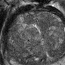
  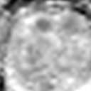
  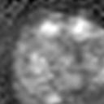
</p>

The same case at `0.5` mm/pixel covers about `64.0 x 64.0` mm and includes more surrounding context.

<p>
  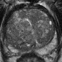
  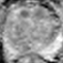
  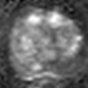
</p>

### Positive Workflow

For positive cases, CROPro uses the prostate gland mask plus a lesion mask. A crop is saved only when the lesion area inside the crop satisfies the configured threshold.

<p>
  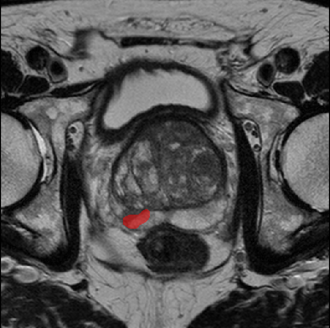
  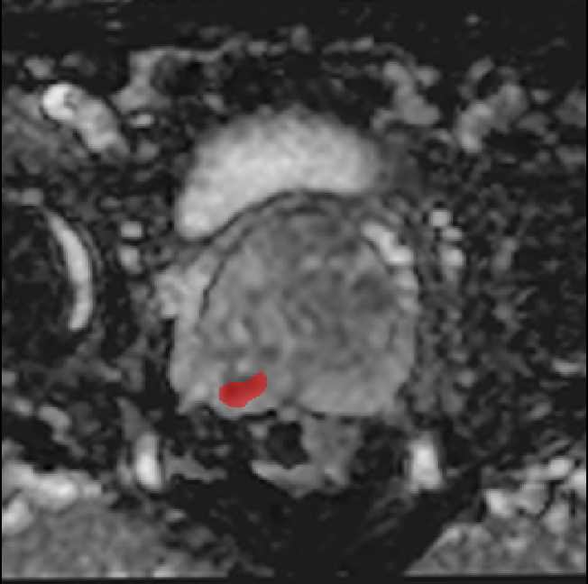
  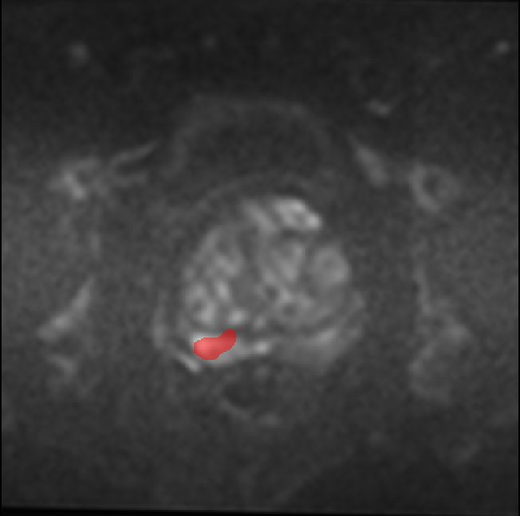
</p>

Stride-cropped bpMRI output at `0.4` mm/pixel:

<p>
  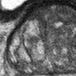
  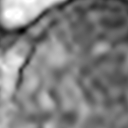
  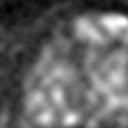
</p>

The same positive case at `0.5` mm/pixel:

<p>
  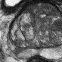
  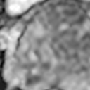
  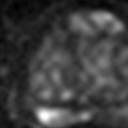
</p>

## Pixel Spacing

`pixel_spacing` controls the target in-plane resolution in millimeters per pixel before cropping. This matters because prostate MRI scans can come from different scanners, protocols, and reconstruction settings. Resampling to a consistent spacing makes crops more comparable across patients.

With `crop_image_size=128`:

| Pixel spacing | Crop size in pixels | Approximate physical area |
| --- | --- | --- |
| `0.4` mm/pixel | `128 x 128` | `51.2 x 51.2` mm |
| `0.5` mm/pixel | `128 x 128` | `64.0 x 64.0` mm |

A `0.4` mm/pixel crop is tighter around the anatomy. A `0.5` mm/pixel crop covers a wider physical region and can preserve more surrounding anatomical context.

```python
from cropro import CROPro, CropConfig

tight_crop = CropConfig(
    crop_method="center",
    patient_status="negative",
    sequence_type="T2W",
    orig_img_path_t2w="data/patient_001/t2w.nii.gz",
    seg_img_path="data/patient_001/prostate_gland_mask.nii.gz",
    pixel_spacing=0.4,
    crop_image_size=128,
    path_to_save="outputs/patient_001_spacing_0.4",
)

wide_crop = CropConfig(
    crop_method="center",
    patient_status="negative",
    sequence_type="T2W",
    orig_img_path_t2w="data/patient_001/t2w.nii.gz",
    seg_img_path="data/patient_001/prostate_gland_mask.nii.gz",
    pixel_spacing=0.5,
    crop_image_size=128,
    path_to_save="outputs/patient_001_spacing_0.5",
)

CROPro(tight_crop).run()
CROPro(wide_crop).run()
```

## PI-CAI Dataset Setup

The runnable examples use the official PI-CAI Public Training and Development Dataset. Images are hosted on Zenodo, and annotations are maintained in the `DIAGNijmegen/picai_labels` repository.

The default download fetches public image fold 0, which is about 5.4 GB, and clones the labels:

```bash
uv sync
bash scripts/download_dataset.sh
```

The script writes data under `dataset/PI-CAI/`. This directory is ignored by git.

The image download is resumable because the script uses `curl -C -`. If the download is interrupted, run the same command again:

```bash
bash scripts/download_dataset.sh
```

To download all five public image folds, about 26.9 GB:

```bash
CROPRO_PICAI_FOLDS="0 1 2 3 4" bash scripts/download_dataset.sh
```

To place the PI-CAI data somewhere else:

```bash
CROPRO_DATASET_ROOT="/path/to/PI-CAI" bash scripts/download_dataset.sh
```

Expected layout:

```text
dataset/PI-CAI/
  archives/
    picai_public_images_fold0.zip
  images/
    10001/
      10001_1000001_t2w.mha
      10001_1000001_adc.mha
      10001_1000001_hbv.mha
  picai_labels/
    anatomical_delineations/whole_gland/AI/Bosma22b/
    csPCa_lesion_delineations/human_expert/resampled/
```

Run the examples:

```bash
uv run python examples/PI-CAI_negative_crop.py
uv run python examples/PI-CAI_positive_crop.py
```

Or run both:

```bash
bash scripts/examples.sh
```

PI-CAI notes:

- Public images: `https://zenodo.org/records/6624726`
- Labels: `https://github.com/DIAGNijmegen/picai_labels`
- Official image names use `[patient_id]_[study_id]_t2w.mha`, `[patient_id]_[study_id]_adc.mha`, and `[patient_id]_[study_id]_hbv.mha`.
- Whole-gland masks are used for `negative` and `unknown` crops.
- Positive crops use the whole-gland mask plus the csPCa lesion mask. Set `tumor_label_level` to the lesion value used by the selected label file. The bundled PI-CAI positive example uses case `10032_1000032`, whose lesion label is `3`.

## Command Line

After installation, use the `cropro` command. From this repository, prefix commands with `uv run`.

Negative or unknown patient:

```bash
uv run cropro \
  --crop_method stride \
  --patient_status negative \
  --sequence_type T2W \
  --orig_img_path_t2w data/patient_001/t2w.nii.gz \
  --seg_img_path data/patient_001/prostate_gland_mask.nii.gz \
  --pixel_spacing 0.4 \
  --crop_image_size 128 \
  --crop_stride 32 \
  --saved_image_type png \
  --path_to_save outputs/patient_001
```

Positive patient:

```bash
uv run cropro \
  --crop_method stride \
  --patient_status positive \
  --sequence_type T2W \
  --orig_img_path_t2w data/patient_002/t2w.nii.gz \
  --seg_img_path data/patient_002/prostate_gland_mask.nii.gz \
  --seg_img_path_lesion data/patient_002/lesion_mask.nii.gz \
  --tumor_label_level 1 \
  --c_min_positive 0.2 \
  --pixel_spacing 0.4 \
  --crop_image_size 128 \
  --crop_stride 32 \
  --saved_image_type png \
  --path_to_save outputs/patient_002
```

Boolean CLI arguments require explicit values:

```bash
uv run cropro --keep_all_slice false --do_normalization true ...
```

## Output

CROPro writes cropped files to `path_to_save`. Filenames include:

- sequence type
- slice number
- crop index when applicable
- crop coordinates
- modality suffix such as `T2W`, `ADC`, or `HBV`

Example:

```text
outputs/patient_001/
  T2W_slice_7_of_21_1_cord_160_166_T2W.png
```

## Configuration Reference

These variables are accepted by the Python `CropConfig` class and by CLI arguments with the same names.

| Setting | Default | Meaning |
| --- | --- | --- |
| `crop_method` | `center` | Crop strategy: `center`, `random`, or `stride`. |
| `orig_img_path_t2w` | `None` | T2W image path. Required for all workflows. |
| `orig_img_path_adc` | `None` | ADC image path. Required when `sequence_type="bpMRI"`. |
| `orig_img_path_hbv` | `None` | HBV image path. Required when `sequence_type="bpMRI"`. |
| `seg_img_path` | `None` | Prostate gland segmentation mask path. Required for negative, unknown, and positive workflows. |
| `seg_img_path_lesion` | `None` | Lesion segmentation mask path. Required for positive patients unless the gland mask already contains lesion labels. |
| `prostate_gland_seg_contains_lesion` | `False` | Set to `True` when `seg_img_path` contains both gland and lesion labels. |
| `tumor_label_level` | `2` | Label value used for lesion pixels. Use `1` if your lesion mask stores lesions as label `1`. |
| `patient_status` | `negative` | `negative`, `positive`, or `unknown`. |
| `pixel_spacing` | `0.5` | Target in-plane spacing in millimeters per pixel before cropping. |
| `crop_image_size` | `128` | Output crop width and height in pixels. |
| `sample_number` | `12` | Number of random crops to try when `crop_method="random"`. |
| `crop_stride` | `32` | Step size in pixels when `crop_method="stride"`. |
| `sequence_type` | `T2W` | `T2W` for T2W-only crops, or `bpMRI` for T2W/ADC/HBV crops. |
| `normalized_image` | `True` | Set to `True` when the source image is already normalized. |
| `normalized_vmaxNumber` | `242` | Maximum value used by the legacy normalization/saving path. |
| `do_normalization` | `False` | Normalize image intensity before saving. |
| `min_percentile` | `0` | Lower percentile for intensity normalization. |
| `max_percentile` | `99.5` | Upper percentile for intensity normalization. |
| `saved_image_type` | `tiff` | Output type: `png`, `jpg`, `jpeg`, `tiff`, `tif`, `npy`, or `nmp`. |
| `path_to_save` | `save_crop` | Output directory. |
| `c_min_positive` | `0.2` | Minimum lesion overlap required for saving a positive crop. |
| `c_min_negative` | `1` | Minimum gland coverage rule used by negative crop selection. |
| `percentage_of_allowed_overlapping_betweeing_gland_lesions_mask` | `50.0` | Allowed overlap percentage between gland and lesion masks for mask consistency checks. |
| `number_of_slices_to_exclude_from_mask_gland` | `1` | Number of gland-mask edge slices to exclude from crop selection. |
| `keep_all_slice` | `True` | Keep all selected slices instead of applying slice filtering. |

## Project Structure

```text
CROPro/
  src/cropro/              # Python package
    cropping/              # Cropping implementation
    cli.py                 # Command-line interface
    config.py              # CropConfig dataclass
    core.py                # CROPro runner
  examples/                # Runnable examples
  tests/                   # Tests
  config/                  # Runtime configuration
  assets/readme/           # README images
  scripts/                 # Dataset and example scripts
  pyproject.toml           # Package metadata and tooling config
  uv.lock                  # Locked development environment
```

## Development

Install development dependencies:

```bash
uv sync --extra dev
```

Run checks:

```bash
uv run ruff check .
uv run pytest
uv run python -m compileall src main.py examples tests
uv build --no-sources
```

Before publishing, make sure the package name and version in `pyproject.toml` are correct. After publication, verify installation in a fresh project:

```bash
uv init cropro-smoke-test
cd cropro-smoke-test
uv add cropro
uv run python -c "from cropro import CROPro, CropConfig; print(CropConfig().crop_method)"
```

For publishing, prefer PyPI Trusted Publishing from CI. If publishing manually, use a scoped PyPI token and avoid storing it in shell history or repository files.

## Troubleshooting

### `ModuleNotFoundError: No module named 'cropro'`

Install the package from the repository root:

```bash
uv sync
```

Then run commands with `uv run`.

### `ModuleNotFoundError: No module named 'SimpleITK'`

Install dependencies:

```bash
uv sync
```

### No crops are saved

Check that:

- `patient_status` matches the case.
- `seg_img_path` points to a non-empty prostate mask.
- Positive cases include `seg_img_path_lesion`, or set `prostate_gland_seg_contains_lesion=True` if lesion labels are inside the gland mask.
- `tumor_label_level` matches the lesion label value in the mask.
- `crop_image_size`, `pixel_spacing`, and `c_min_positive` are not too restrictive.
- T2W, ADC, HBV, gland mask, and lesion mask are spatially aligned.

### PI-CAI download is interrupted

Run the downloader again. It resumes partial archives:

```bash
bash scripts/download_dataset.sh
```

## Citation

If you use CROPro, please cite:

```bibtex
@article{10.1117/1.JMI.10.2.024004,
  author = {Alexandros Patsanis and Mohammed R. S. Sunoqrot and Tone F. Bathen and Mattijs Elschot},
  title = {{CROPro: a tool for automated cropping of prostate magnetic resonance images}},
  volume = {10},
  journal = {Journal of Medical Imaging},
  number = {2},
  publisher = {SPIE},
  pages = {024004},
  year = {2023},
  doi = {10.1117/1.JMI.10.2.024004},
  url = {https://doi.org/10.1117/1.JMI.10.2.024004}
}
```

## License

CROPro is distributed under the MIT License. See [LICENSE](LICENSE).
