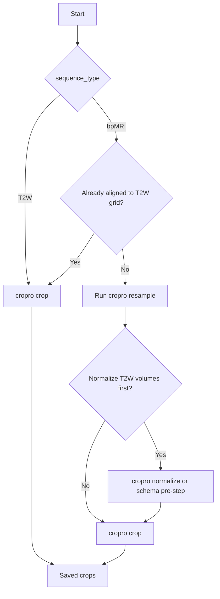

# CROPro

CROPro is built for prostate MRI AI teams where model performance is often limited by data preparation, not network architecture. It turns heterogeneous T2W/bpMRI volumes and gland/lesion masks into consistent, spatially aligned, model-ready crops for clinically significant prostate cancer (csPCa) training and patient-level evaluation.

The package supports:

- four CLI pipelines: `download`, `crop`, `resample`, and `normalize`
- `center`, `random`, and `stride` crop strategies
- T2W-only and bpMRI cropping workflows
- negative, positive, and unknown patient-status workflows
- configurable in-plane resampling through `pixel_spacing`
- a configurable dataset layout so the same pipelines work on multiple databases
- Python API and command-line usage

If you use CROPro, please cite the paper listed in [Citation](#citation):
`CROPro: a tool for automated cropping of prostate magnetic resonance images`.

## Contents

- [Installation](#installation)
- [Pipelines](#pipelines)
- [Quick Start](#quick-start)
- [Input Data](#input-data)
- [Patient Workflows](#patient-workflows)
- [Visual Examples](#visual-examples)
- [Pixel Spacing](#pixel-spacing)
- [PI-CAI Dataset Setup](#pi-cai-dataset-setup)
- [Command Line](#command-line)
- [Configuration Reference](#configuration-reference)
- [Dataset Splitting](#dataset-splitting)
- [Development](#development)
- [PyPI Release](#pypi-release)
- [Citation](#citation)

## Installation

Install as a package (recommended):

Install CROPro into your project environment:

```bash
uv add cropro
```

Or install as a standalone CLI tool:

```bash
uv tool install cropro
```

Then discover all available commands/options:

```bash
cropro --help
cropro download --help
cropro crop --help
cropro resample --help
cropro normalize --help
```

Download datasets directly from CLI (no repo scripts required):

```bash
# PI-CAI fold 0 + labels
cropro download --dataset picai --folds 0

# Prostate158 (built-in Zenodo URL)
cropro download --dataset prostate158

# Prostate158 (optional explicit URL override)
cropro download --dataset prostate158 \
  --url https://zenodo.org/api/records/6481141/files/prostate158_train.zip/content
```

### Simplest run (resample -> crop)

No INI file is required. For users who installed via `uv add cropro`, run with
explicit paths:

```bash
# 1) align ADC/HBV/masks to T2W first (no config file)
cropro resample \
  --images-root dataset/PI-CAI/images \
  --output-root dataset/PI-CAI/images_resampled

# 2) crop one case from the aligned data
cropro crop --crop_method stride --patient_status negative --sequence_type bpMRI \
  --orig_img_path_t2w dataset/PI-CAI/images_resampled/10001/10001_1000001_t2w.mha \
  --orig_img_path_adc dataset/PI-CAI/images_resampled/10001/10001_1000001_adc.mha \
  --orig_img_path_hbv dataset/PI-CAI/images_resampled/10001/10001_1000001_hbv.mha \
  --seg_img_path dataset/PI-CAI/images_resampled/10001/10001_1000001_gland.nii.gz \
  --pixel_spacing 0.4 --crop_image_size 128 --crop_stride 32 \
  --saved_image_type png --path_to_save outputs/10001_1000001
```

If you do have `config/resample_paths.ini`, this is the shorter equivalent:

```bash
# 1) align ADC/HBV/masks to T2W first
cropro resample --config config/resample_paths.ini
```

If you are using the built-in PI-CAI schema, you can run the full pipeline in
one command:

```bash
cropro crop --schema config/dataset_picai.toml
```

### Crop multiple patients (folder/batch mode)

`cropro crop` also supports folder-level batch mode directly via
`--images-root` and `--output-root` (no example script required):

```bash
cropro crop \
  --images-root dataset/PI-CAI/images_resampled \
  --output-root dataset/cropro/PI-CAI/PICAI_stride_0.4_128 \
  --sequence_type bpMRI --crop_method stride \
  --pixel_spacing 0.4 --crop_image_size 128 --crop_stride 32 \
  --saved_image_type png
```

For custom databases (for example Prostate158-style naming), override suffixes
and mask roots:

```bash
cropro crop \
  --images-root data/Prostate158/images \
  --output-root outputs/Prostate158 \
  --sequence_type T2W \
  --t2w-suffix _t2.nii.gz \
  --mask-suffix .nii.gz \
  --gland-root data/Prostate158/masks/gland \
  --crop_method center --saved_image_type png
```

Batch mode can auto-detect positive/negative cases from lesion masks
(`--auto-patient-status true`, default) and can auto-detect
`tumor_label_level` from lesion labels (`--auto-tumor-label-level true`).

You can still use the provided Python scripts if you prefer:

```bash
# Batch crop all cases under dataset/PI-CAI/images_resampled
python examples/PI-CAI_resampled_crop.py

# Batch crop + split into train/val/test
python examples/PI-CAI_train_test_val_crop.py
```

Both scripts iterate through patient folders automatically and run CROPro case
by case with consistent settings.

## Pipelines

CROPro exposes four pipelines as command-line subcommands. Pick the one that
matches what you need; they can be combined (for example: normalize T2W first,
then resample, then crop).

| Pipeline | Command | What it does |
| --- | --- | --- |
| Download | `cropro download` | Downloads and extracts supported datasets via CLI. Built-in PI-CAI and Prostate158 support; `custom` via one or more `--url` values. |
| Resample | `cropro resample` | Resamples a whole database onto each case's T2W grid and writes the aligned copies to disk. Use this to prepare a dataset before cropping. |
| Normalize | `cropro normalize` | Normalizes whole T2W volumes across a dataset (for example AutoRef, percentile, gaussian, or zscore_clip) either in-place or into a separate output folder. |
| Crop | `cropro crop` | Crops T2W (and optionally ADC/HBV) around the gland or lesion. For bpMRI it verifies that ADC/HBV are aligned to T2W and stops with a clear message if they are not. |

Running `cropro` without a subcommand defaults to `crop`, so existing commands
keep working unchanged.

### Pipeline overview at a glance

Use this as a quick decision guide:

| Goal | Minimum pipeline | Recommended pipeline |
| --- | --- | --- |
| Crop T2W only (`sequence_type=T2W`) | `crop` | `crop` |
| Crop bpMRI (`sequence_type=bpMRI`) | `crop` + on-the-fly alignment (`--resample_bpmri_to_t2w true`) | `normalize` -> `resample` -> `crop` |
| Build a reusable aligned dataset | `resample` | `normalize` -> `resample` |
| Normalize all T2W volumes in a folder | `normalize` | `normalize` |

For bpMRI, **alignment to T2W is required** before cropping ADC/HBV together
with T2W. You can satisfy this in two ways:

1. Run `cropro resample` first (recommended for reproducible dataset prep).
2. Let crop do on-the-fly alignment with `--resample_bpmri_to_t2w true` (or
   `--resample_first true` to also align masks before cropping).

If neither is enabled and the bpMRI volumes are misaligned, crop stops with an
actionable error instead of producing wrong crops.


```mermaid
flowchart TD
  A[Start] --> B{sequence_type}
  B -->|T2W| C[cropro crop]
  B -->|bpMRI| D{Already aligned to T2W grid?}
  D -->|Yes| C
  D -->|No| E[Run cropro resample]
  E --> F{Normalize T2W volumes first?}
  F -->|Yes| G[cropro normalize or schema pre-step]
  F -->|No| H[cropro crop]
  G --> H
  C --> I[Saved crops]
  H --> I
```

### Resample Pipeline

The resample pipeline aligns every case in a database onto its T2W geometry. It
is database-agnostic: the file layout is described by a configurable
`DatasetLayout`, which defaults to the PI-CAI conventions but can be pointed at
any dataset through a **dataset schema**, CLI flags, or an INI file.

When `--normalize-t2w-first true` is enabled, CROPro first normalizes each T2W
volume and writes the resulting `.mha` files under
`<images-root>/../normalized/<method>_t2w` by default. Resampling then uses
those normalized T2W files as the reference grid while still reading ADC/HBV and
masks from the original dataset tree. For PI-CAI, the built-in schema defaults
this path to `dataset/PI-CAI/normalized/autoref_t2w`.

```bash
# Resample the PI-CAI database using a dataset schema (all paths in one file)
uv run cropro resample --schema config/dataset_picai.toml

# Resample Prostate158 with its built-in schema
uv run cropro resample --schema config/dataset_prostate158.toml

# Or pass paths directly
uv run cropro resample \
  --images-root dataset/PI-CAI/images \
  --output-root dataset/PI-CAI/images_resampled
```

Resampled T2W/ADC/HBV scans use B-spline interpolation; gland and lesion masks
use nearest-neighbour. The output mirrors the input folder structure. Omit
`--output-root` to write the aligned copies next to the originals with a
`_to_t2w` suffix.

If a `*.zip` image archive is present (for the PI-CAI layout this defaults to
`dataset/PI-CAI/archives`, i.e. `<images-root>/../archives`), the pipeline
unpacks it into `--images-root` before aligning. Existing files are skipped, so
the step is safe to re-run. Point `--archives-root` at a different directory, or
pass `--archives-root none` to disable extraction.

#### Dataset schema (recommended for custom datasets)

A dataset schema is a TOML file that describes the complete layout of a dataset
in one place — image paths, mask locations, file naming conventions, and default
crop settings. CROPro ships ready-made schemas for PI-CAI and Prostate158 under
`config/`.

```toml
# config/my_dataset.toml

[dataset]
name = "MyDataset"

[paths]
images_root  = "dataset/MyDataset/images"
output_root  = "dataset/MyDataset/images_resampled"
normalized_t2w_root = "dataset/MyDataset/normalized/autoref_t2w"
gland_root   = "dataset/MyDataset/masks/gland"   # or "none" to skip
lesion_root  = "dataset/MyDataset/masks/lesion"  # or "none" to skip
archives_root = "none"
cropro_root  = "dataset/MyDataset/cropped_images"

[naming]
t2w_suffix  = "_t2w.nii.gz"
adc_suffix  = "_adc.nii.gz"
hbv_suffix  = "_hbv.nii.gz"
mask_suffix = ".nii.gz"

[crop]
sequence_type    = "bpMRI"
pixel_spacing    = 0.4
crop_image_size  = 128
crop_method      = "random"
saved_image_type = "png"

[split]
enabled         = true
split_level     = "patient"
human_labels_root = ""

[pipeline]
normalize_before_resample = true
normalize_method = "autoref"
resample_dataset = true
```

All sections are optional and fall back to CROPro defaults when omitted.

Use the schema across all pipelines. With the example above, one command does
dataset-level T2W normalization first, then resampling, then train/val/test
splitting, then cropping:

```bash
# One command: resample -> split -> crop
cropro crop --schema config/my_dataset.toml

# Built-in PI-CAI schema
cropro crop --schema config/dataset_picai.toml

# CLI flags always override schema values
cropro resample --schema config/my_dataset.toml --output-root /tmp/resampled
```

The crop output path is derived from `cropro_root` and the run name, for
example `dataset/MyDataset/cropped_images/MyDataset_random_0.4_128/`.

To target a different database without a schema, pass the suffixes and mask roots
directly:

```bash
uv run cropro resample \
  --images-root data/my_dataset/images \
  --output-root data/my_dataset/resampled \
  --t2w-suffix _t2w.nii.gz \
  --adc-suffix _adc.nii.gz \
  --hbv-suffix _hbv.nii.gz \
  --gland-root data/my_dataset/masks/gland \
  --lesion-root data/my_dataset/masks/lesion
```

or keep only the paths in the legacy INI file and pass `--config`:

```ini
# config/resample_paths.ini
[paths]
images_root = data/my_dataset/images
output_root = data/my_dataset/resampled
gland_root  = data/my_dataset/masks/gland
lesion_root = data/my_dataset/masks/lesion
```

```bash
uv run cropro resample --config config/resample_paths.ini
```

CLI flags take precedence over schema and INI values, so you can keep shared
paths in the file and override individual fields on the command line.

The same pre-step can be enabled directly on the resample CLI:

```bash
uv run cropro resample \
  --images-root dataset/PI-CAI/images \
  --output-root dataset/PI-CAI/images_resampled \
  --normalize-t2w-first true \
  --normalize-method autoref \
  --normalized-t2w-root dataset/PI-CAI/normalized/autoref_t2w
```

### Crop Pipeline

The crop pipeline is the original CROPro behaviour. See
[Quick Start](#quick-start) and [Command Line](#command-line) for examples. For
bpMRI it first checks that ADC and HBV are aligned to T2W; if they are not, it
stops and tells you to run the resample pipeline (or to let it resample on the
fly). See [Aligning ADC/HBV to T2W (bpMRI)](#aligning-adchbv-to-t2w-bpmri).

### Normalize Pipeline

The normalize pipeline applies one normalization method to every discovered T2W
volume in a dataset. It can normalize in-place or write outputs into a mirrored
directory structure.

```bash
# Normalize T2W volumes in place with AutoRef
uv run cropro normalize \
  --images-root dataset/PI-CAI/images_resampled \
  --method autoref

# Normalize into a separate folder with zscore_clip
uv run cropro normalize \
  --images-root dataset/PI-CAI/images_resampled \
  --output-root dataset/PI-CAI/images_resampled_norm \
  --method zscore_clip \
  --min-percentile 0.5 \
  --max-percentile 99.5
```

## Quick Start

### Crop A Negative Or Unknown Case

Use this when you have a T2W image and a prostate gland mask. For `unknown` patient status, CROPro uses the same gland-mask workflow as `negative`, which is useful for inference or review cases where cancer status is not known yet.

```python
from cropro import CROPro, CropConfig

config = CropConfig(
    crop_method="stride",
    patient_status="negative",  # "negative" or "unknown"
    sequence_type="T2W",
    orig_img_path_t2w="data/patient_001/t2w.nii.gz",
    seg_img_path="data/patient_001/prostate_gland_mask.nii.gz",
    pixel_spacing=0.4,
    crop_image_size=128,
    crop_stride=32,
    saved_image_type="png",
    path_to_save="outputs/patient_001",
)

CROPro(config).run()
```

### Crop A Positive Case

Use this when you have a prostate gland mask and a lesion mask. The gland mask defines the anatomical search region; the lesion mask is used to keep crops that contain enough lesion area.

```python
from cropro import CROPro, CropConfig

config = CropConfig(
    crop_method="stride",
    patient_status="positive",
    sequence_type="T2W",
    orig_img_path_t2w="data/patient_002/t2w.nii.gz",
    seg_img_path="data/patient_002/prostate_gland_mask.nii.gz",
    seg_img_path_lesion="data/patient_002/lesion_mask.nii.gz",
    tumor_label_level=1,
    c_min_positive=0.2,
    pixel_spacing=0.4,
    crop_image_size=128,
    crop_stride=32,
    saved_image_type="png",
    path_to_save="outputs/patient_002",
)

CROPro(config).run()
```

### Crop bpMRI

Set `sequence_type="bpMRI"` and provide T2W, ADC, and HBV images. CROPro saves aligned crops for each modality.

```python
from cropro import CROPro, CropConfig

config = CropConfig(
    crop_method="center",
    patient_status="negative",
    sequence_type="bpMRI",
    orig_img_path_t2w="data/patient_003/t2w.nii.gz",
    orig_img_path_adc="data/patient_003/adc.nii.gz",
    orig_img_path_hbv="data/patient_003/hbv.nii.gz",
    seg_img_path="data/patient_003/prostate_gland_mask.nii.gz",
    pixel_spacing=0.5,
    crop_image_size=128,
    saved_image_type="png",
    path_to_save="outputs/patient_003",
)

CROPro(config).run()
```

## Input Data

CROPro reads 3D medical image files through SimpleITK. Common formats include `.nii`, `.nii.gz`, `.mha`, `.mhd`, and other SimpleITK-readable formats.

For a negative or unknown patient, provide:

- T2W image
- prostate gland segmentation mask

For a positive patient, provide:

- T2W image
- prostate gland segmentation mask
- lesion segmentation mask

For `sequence_type="bpMRI"`, also provide:

- ADC image
- HBV image

All images and masks should already be spatially aligned. CROPro resamples the image spacing for crop generation, but it does not perform image registration.

## Patient Workflows

| Status | Intended use | Segmentation behavior |
| --- | --- | --- |
| `negative` | Cancer-free cases | Uses the prostate gland mask to crop the prostate region. |
| `positive` | Cancer-present cases | Uses the prostate gland mask for crop placement and the lesion mask to keep crops containing enough lesion area. |
| `unknown` | Inference, testing, or review cases with unknown health status | Uses the prostate gland mask like the negative workflow and returns candidate prostate-region crops. |

## Visual Examples

Example segmentation and crop outputs are available in `assets/readme/`.
The quickest way to inspect behavior is to run the examples in
[`examples/`](examples/) and view the generated crops in your output folder.

## Pixel Spacing

`pixel_spacing` controls the target in-plane resolution in millimeters per pixel before cropping. This matters because prostate MRI scans can come from different scanners, protocols, and reconstruction settings. Resampling to a consistent spacing makes crops more comparable across patients.

With `crop_image_size=128`:

| Pixel spacing | Crop size in pixels | Approximate physical area |
| --- | --- | --- |
| `0.4` mm/pixel | `128 x 128` | `51.2 x 51.2` mm |
| `0.5` mm/pixel | `128 x 128` | `64.0 x 64.0` mm |

A `0.4` mm/pixel crop is tighter around the anatomy. A `0.5` mm/pixel crop covers a wider physical region and can preserve more surrounding anatomical context.

## PI-CAI Dataset Setup

The examples use the PI-CAI Public Training/Development data.

Quick setup:

```bash
cropro download --dataset picai --folds 0
```

Data is written under `dataset/PI-CAI/`.

Useful variants:

```bash
# download all public image folds (~26.9 GB)
cropro download --dataset picai --folds 0 1 2 3 4

# custom dataset location
cropro download --dataset picai --dataset-root /path/to/PI-CAI
```

Run examples:

```bash
uv run python examples/PI-CAI_negative_crop.py
uv run python examples/PI-CAI_positive_crop.py
```

References:

- Public images: `https://zenodo.org/records/6624726`
- Labels: `https://github.com/DIAGNijmegen/picai_labels`

## Command Line

After installation, use the `cropro` command. It has four subcommands:
`download`, `crop`, `resample`, and `normalize` (see [Pipelines](#pipelines)). Running
`cropro` with no subcommand defaults to `crop`. From this repository, prefix
commands with `uv run`.

List all available options:

```bash
uv run cropro --help
uv run cropro download --help
uv run cropro crop --help
uv run cropro resample --help
uv run cropro normalize --help
```

Negative or unknown patient:

```bash
uv run cropro crop \
  --crop_method stride \
  --patient_status negative \
  --sequence_type T2W \
  --orig_img_path_t2w data/patient_001/t2w.nii.gz \
  --seg_img_path data/patient_001/prostate_gland_mask.nii.gz \
  --pixel_spacing 0.4 \
  --crop_image_size 128 \
  --crop_stride 32 \
  --saved_image_type png \
  --path_to_save outputs/patient_001
```
For positive and bpMRI examples, see [Quick Start](#quick-start).

Boolean CLI arguments require explicit values:

```bash
uv run cropro crop --keep_all_slice false --do_normalization true ...
```

## Output

CROPro writes cropped files to `path_to_save`. Filenames include:

- sequence type
- slice number
- crop index when applicable
- crop coordinates
- modality suffix such as `T2W`, `ADC`, or `HBV`

Example:

```text
outputs/patient_001/
  T2W_slice_7_of_21_1_cord_160_166_T2W.png
```

## Configuration Reference

These variables are accepted by the Python `CropConfig` class and by CLI arguments with the same names.

| Setting | Default | Meaning |
| --- | --- | --- |
| `crop_method` | `center` | Crop strategy: `center`, `random`, or `stride`. |
| `orig_img_path_t2w` | `None` | T2W image path. Required for all workflows. |
| `orig_img_path_adc` | `None` | ADC image path. Required when `sequence_type="bpMRI"`. |
| `orig_img_path_hbv` | `None` | HBV image path. Required when `sequence_type="bpMRI"`. |
| `seg_img_path` | `None` | Prostate gland segmentation mask path. Required for negative, unknown, and positive workflows. |
| `seg_img_path_lesion` | `None` | Lesion segmentation mask path. Required for positive patients unless the gland mask already contains lesion labels. |
| `prostate_gland_seg_contains_lesion` | `False` | Set to `True` when `seg_img_path` contains both gland and lesion labels. |
| `tumor_label_level` | `2` | Label value used for lesion pixels. Use `1` if your lesion mask stores lesions as label `1`. |
| `patient_status` | `negative` | `negative`, `positive`, or `unknown`. |
| `pixel_spacing` | `0.5` | Target in-plane spacing in millimeters per pixel before cropping. |
| `crop_image_size` | `128` | Output crop width and height in pixels. |
| `sample_number` | `12` | Number of random crops to try when `crop_method="random"`. |
| `crop_stride` | `32` | Step size in pixels when `crop_method="stride"`. |
| `sequence_type` | `T2W` | `T2W` for T2W-only crops, or `bpMRI` for T2W/ADC/HBV crops. |
| `resample_bpmri_to_t2w` | `False` | When `True`, resample ADC/HBV onto the T2W grid on-the-fly so all sequences align before cropping. |
| `resample_first` | `False` | When `True`, run a pre-step that resamples **all** images (T2W, ADC, HBV and the segmentation masks) onto the common T2W grid before cropping. Implies `resample_bpmri_to_t2w` and also aligns the masks. |
| `skip_existing_slices` | `False` | Skip slice processing when output files for that slice already exist. Useful for resumable runs. |
| `normalized_image` | `True` | Set to `True` when the source image is already normalized. |
| `normalized_vmaxNumber` | `242` | Maximum value used by the legacy normalization/saving path. |
| `do_normalization` | `False` | Normalize image intensity before saving. |
| `t2w_normalization_method` | `autoref` | Normalization strategy for T2W: `percentile`, `autoref`, `gaussian`, or `zscore_clip`. |
| `adc_normalization_method` | `percentile` | Normalization strategy for ADC (`percentile`, `gaussian`, `zscore_clip`; `autoref` is T2W-only). |
| `hbv_normalization_method` | `percentile` | Normalization strategy for HBV (`percentile`, `gaussian`, `zscore_clip`; `autoref` is T2W-only). |
| `min_percentile` | `0.5` | Lower percentile for intensity clipping/normalization. |
| `max_percentile` | `99.5` | Upper percentile for intensity clipping/normalization. |
| `saved_image_type` | `tiff` | Output type: `png`, `jpg`, `jpeg`, `tiff`, `tif`, `npy`, `nmp`, or `npm` (`nmp`/`npm` map to `npy`). |
| `path_to_save` | `save_crop` | Output directory. |
| `c_min_positive` | `0.2` | Minimum lesion overlap required for saving a positive crop. |
| `c_min_negative` | `1` | Minimum gland coverage rule used by negative crop selection. |
| `percentage_of_allowed_overlapping_betweeing_gland_lesions_mask` | `50.0` | Allowed overlap percentage between gland and lesion masks for mask consistency checks. |
| `number_of_slices_to_exclude_from_mask_gland` | `1` | Number of gland-mask edge slices to exclude from crop selection. |
| `keep_all_slice` | `True` | Keep all selected slices instead of applying slice filtering. |
| `random_seed` | `None` | Optional integer seed for deterministic random crop sampling. |

### Aligning ADC/HBV to T2W (bpMRI)

In PI-CAI the T2W, ADC and HBV sequences are acquired independently and often
differ in slice count and in-plane size/spacing. Since CROPro crops all three at
the same slice index and `(x, y)` origin, a mismatch can produce misaligned crops
or an `IndexError`.

By default the crop pipeline **checks** that ADC and HBV are aligned to T2W before
it starts. If they are not, it stops with a clear message instead of producing
misaligned crops, and points you to the two ways of fixing it:

- **Resample pipeline (recommended)** — run [`cropro resample`](#resample-pipeline)
  once to write aligned copies of the whole database, then crop those.

  ```bash
  uv run cropro resample --images-root dataset/PI-CAI/images --output-root dataset/PI-CAI/images_resampled
  ```

  This writes the resampled ADC/HBV files for every case into a new
  `dataset/PI-CAI/images_resampled` folder (named `{patient}_{study}_adc.mha` and
  `{patient}_{study}_hbv.mha`). Omit `--output-root` to write the aligned copies
  next to the originals with a `_to_t2w` suffix instead.

- **On-the-fly during cropping** — pass `--resample_bpmri_to_t2w true`. CROPro then
  resamples each ADC/HBV volume onto the resampled T2W grid as it loads them (no
  extra files written) and the alignment check is skipped. Intensity images use
  B-spline interpolation; the T2W reference is reused across the case.

```bash
uv run cropro --sequence_type bpMRI --resample_bpmri_to_t2w true ...
```

To resample **everything first** — including the gland/lesion masks — pass
`--resample_first true`. This runs an explicit pre-step that aligns T2W, ADC, HBV
and the segmentation masks onto the same T2W grid before any cropping starts, so
the crop coordinates are guaranteed to match across every image. It implies
`--resample_bpmri_to_t2w`:

```bash
uv run cropro --sequence_type bpMRI --resample_first true ...
```

### Intensity normalization

Normalization is configured **per sequence**: T2W, ADC and HBV each name a
strategy from the registry in
[`cropro.cropping.normalizers`](src/cropro/cropping/normalizers.py)
(`percentile`, `autoref`, `gaussian`, `zscore_clip`). The defaults are
`t2w_normalization_method=autoref`, `adc_normalization_method=percentile` and
`hbv_normalization_method=percentile`.

By default (`do_normalization=False`) crops are saved with their **raw**
intensities, which is the safest choice for quantitative sequences such as ADC.
When `do_normalization=True`, each sequence's configured strategy selects how its
intensities are scaled. A good general recipe is `zscore_clip`, which clips each
sequence to its `[min_percentile, max_percentile]` percentiles and then applies
instance-wise z-score normalization, independently for T2W, ADC and HBV. The
defaults `min_percentile=0.5` and `max_percentile=99.5` match the
[`picai_baseline`](https://github.com/DIAGNijmegen/picai_baseline) U-Net recipe:

```bash
uv run cropro --do_normalization true \
  --t2w_normalization_method zscore_clip \
  --adc_normalization_method zscore_clip \
  --hbv_normalization_method zscore_clip \
  --min_percentile 0.5 --max_percentile 99.5 ...
```

#### Per-modality normalization

Different sequences benefit from different normalization. T2W has no fixed
quantitative meaning and works well with `autoref` (AutoRef fat/muscle reference
normalization, via [`pyAutoRef`](https://github.com/MohammedSunoqrot/pyAutoRef))
or `gaussian`, while ADC and HBV are better kept on a robust percentile window —
which is exactly the default configuration. Override any sequence to mix methods
in a single run:

```bash
uv run cropro --do_normalization true \
  --t2w_normalization_method autoref \
  --adc_normalization_method percentile \
  --hbv_normalization_method percentile ...
```

`autoref` is only valid for T2W (it detects fat/muscle reference tissue in the
T2W volume); setting it for ADC or HBV raises a configuration error. AutoRef runs
once over the full T2W volume and the derived scaling is reused for every crop.

To add a new normalization method, write a `Normalizer` subclass in
[`normalizers.py`](src/cropro/cropping/normalizers.py) and decorate it with
`@register_normalizer`; it becomes selectable by name with no changes to the
file-writing code.

## Dataset Splitting

CROPro includes a patient-level dataset splitter that divides cases into
**train / validation / test** subsets and generates crops with the appropriate
strategy for each.

Splitting is always at the **patient level** so that all crops from the same
patient end up in a single subset and there is no data leakage.

### Why different crop methods per subset?

| Subset | Recommended crop method | Reason |
| --- | --- | --- |
| **Train** | `random` (or `center`) | Stochastic sampling gives data augmentation and exposes the model to varied prostate sub-regions per slice. |
| **Validation** | `stride` | Covers the entire prostate area on every slice without gaps, which is required for patient-level scoring (per-crop predictions are aggregated back into one patient score). |
| **Test** | `stride` | Same reason as validation — complete coverage is mandatory for fair patient-level evaluation. |

### Split level

The `split_level` option controls which **slices** are included when generating
crops for each subset:

| Level | `keep_all_slice` | What is included |
| --- | --- | --- |
| `"patient"` (default) | `True` | Every slice that contains the prostate gland mask is cropped. **Required for patient-level inference.** |
| `"lesion"` | `False` | Only lesion-containing slices (positive cases) or central gland slices (negative cases). Useful for slice/image-level training. |

### Annotation quality filter

Passing a `test_eligible` set to `split_cases()` restricts which cases may appear
in the test subset. Cases not in the set go to train/val only. This prevents
AI-annotated labels from contaminating the test set — a requirement for fair
clinical evaluation.

For PI-CAI, human expert lesion delineations live under:

```text
dataset/PI-CAI/picai_labels/csPCa_lesion_delineations/Human_expert/
```

The example script auto-detects which case stems have a file there and restricts
the test set to those human-annotated positives plus all negative cases.

### Python API

```python
from cropro import SplitConfig, DatasetSplit, split_cases

cases = [("10000", "10000_1000000"), ("10001", "10001_1000001"), ...]
positives = {("10001", "10001_1000001"), ...}
human_annotated = {("10001", "10001_1000001"), ...}   # from Human_expert/ folder
negatives = set(cases) - positives

config = SplitConfig(
    train_ratio=0.70,
    val_ratio=0.15,
    test_ratio=0.15,
    seed=42,
    stratify=True,        # preserve positive fraction in each subset
    split_level="patient",  # "patient" or "lesion"
)

split: DatasetSplit = split_cases(
    cases,
    positives=positives,
    test_eligible=human_annotated | negatives,  # None = all cases eligible
    config=config,
)
print(split.summary())
# DatasetSplit(train=..., val=..., test=..., total=...)
print(split.train)   # list of (patient_id, stem) tuples
print(split.val)
print(split.test)
```

### Running the full PI-CAI example

After running the resample pipeline (see [Aligning ADC/HBV to T2W](#aligning-adchbv-to-t2w-bpmri)):

```bash
# Resample the dataset first (if not already done)
uv run cropro resample --config config/resample_paths.ini

# Crop and split into train / val / test
uv run python examples/PI-CAI_train_test_val_crop.py
```

The script-level knobs are intentionally simple: train/eval crop methods,
`split_level`, annotation filter flag, and split ratios/seed.

Outputs are written to:

```text
dataset/cropro/PI-CAI/<run_name>/
  train/<patient_id>/<stem>/   ← random crops, all resampled slices
  val/<patient_id>/<stem>/     ← stride crops, all resampled slices
  test/<patient_id>/<stem>/    ← stride crops, human-annotated only
```

Each crop filename encodes its origin (sequence type, slice number, coordinates
and modality suffix), so per-crop predictions can be mapped back to the original
prostate volume for patient-level aggregation.

### Adapting to other datasets

The splitter is dataset-agnostic. For a dataset without a dedicated
annotation-quality field:

- Pass `test_eligible=None` (default) to allow all cases in the test set.
- Or build your own set from a CSV / JSON manifest and pass it as
  `test_eligible`.
- Replace `human_annotated_cases()` in the example with your own lookup logic.

## Project Structure

```text
CROPro/
  src/cropro/              # Python package
    cropping/              # Cropping implementation
    cli.py                 # Command-line interface
    config.py              # CropConfig dataclass
    core.py                # CROPro runner
  examples/                # Runnable examples
  tests/                   # Tests
  config/                  # Runtime configuration
  assets/readme/           # README images
  scripts/                 # Dataset and example scripts
  pyproject.toml           # Package metadata and tooling config
  uv.lock                  # Locked development environment
```

## Development

### Source installation (for contributors)

This repository uses [`uv`](https://docs.astral.sh/uv/) for dependency management.

Install `uv` if needed:

```bash
curl -LsSf https://astral.sh/uv/install.sh | sh
```

Clone the repository and install dependencies:

```bash
git clone https://github.com/alexofficial/CROPro.git
cd CROPro
uv sync
```

Check that the CLI is available in the repo environment:

```bash
uv run cropro --help
```

Install development dependencies:

```bash
uv sync --extra dev
```

Run checks:

```bash
uv run ruff check .
uv run pytest
uv run python -m compileall src main.py examples tests
uv build --no-sources
```

Before publishing, make sure the package name and version in `pyproject.toml` are correct. After publication, verify installation in a fresh project:

```bash
uv init cropro-smoke-test
cd cropro-smoke-test
uv add cropro
uv run python -c "from cropro import CROPro, CropConfig; print(CropConfig().crop_method)"
```

For publishing, prefer PyPI Trusted Publishing from CI. If publishing manually, use a scoped PyPI token and avoid storing it in shell history or repository files.

## Troubleshooting

### `ModuleNotFoundError: No module named 'cropro'`

Install the package from the repository root:

```bash
uv sync
```

Then run commands with `uv run`.

### `ModuleNotFoundError: No module named 'SimpleITK'`

Install dependencies:

```bash
uv sync
```

### No crops are saved

Check that:

- `patient_status` matches the case.
- `seg_img_path` points to a non-empty prostate mask.
- Positive cases include `seg_img_path_lesion`, or set `prostate_gland_seg_contains_lesion=True` if lesion labels are inside the gland mask.
- `tumor_label_level` matches the lesion label value in the mask.
- `crop_image_size`, `pixel_spacing`, and `c_min_positive` are not too restrictive.
- T2W, ADC, HBV, gland mask, and lesion mask are spatially aligned.

### PI-CAI download is interrupted

Run the downloader again. It resumes partial archives:

```bash
bash scripts/download_dataset.sh
```

## Citation

If you use CROPro, please cite:

```bibtex
@article{10.1117/1.JMI.10.2.024004,
  author = {Alexandros Patsanis and Mohammed R. S. Sunoqrot and Tone F. Bathen and Mattijs Elschot},
  title = {{CROPro: a tool for automated cropping of prostate magnetic resonance images}},
  volume = {10},
  journal = {Journal of Medical Imaging},
  number = {2},
  publisher = {SPIE},
  pages = {024004},
  year = {2023},
  doi = {10.1117/1.JMI.10.2.024004},
  url = {https://doi.org/10.1117/1.JMI.10.2.024004}
}
```

## License

CROPro is distributed under the MIT License. See [LICENSE](LICENSE).
