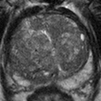
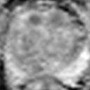

# **CROPro: A tool for automated cropping of prostate MR images**

This repository provides the official implementation of `CROPro: A tool for automated cropping of prostate MR images`. 

The official implementation was performed with T2-weighted images. However, in this repository we also included cropping biMRI sequences (T2W, ADC, HBV).

----

## **Read Before use**


### **What CROPro can do?**
First, there are three different teqnuinces implemented: `Center`, `Random` and `Stride` cropping that can be used. Second, depending on `patient status (negative/unknown and positive)`, CROPro can be used to crop patches of MRI images with different settings. Below, we provide an example:

- In a patient with negative ("healthy") or a patient with ("unknown") health status, CROPro can be used to crop patches of images over the prostate area. In both scenarios (negative/unknown), segmentation of the MRI prostate gland area is required. 
- In a patient with positive health status ("lesion"), CROPro can be used to crop areas of MRI images with lesions. where both prosatte  and lesion masks/segmentations are required.

 > - There are also a number of settings that can be used. These include `automatic normalization`, `exclusion of slices` from the apex (first) and the base (last) of MRI images, `criteria for cropping` based `on percent overlap` between prostate and lesion segmentation mask (positive), and so on (see `main.py`).
 > - In addition, for `positive` patients, the method uses prostate segmentation to crop the images. However, for each cropped image, a comparison of the lesion area within the cropped image is automatically performed. If this is successful, the cropped images are saved.
 > - when cropping with CROPro for a `negative` patient, CROPro uses the slices for which there is prostate gland segmentation. Further, it will exclude slices depending on the size of the segmentation (e.g., very small segmentation areas are not considered). 

### **_Why crop only slices with tumor ?_** 
- In this implementation, the mains reason of cropping slices with lesions was to use them for training the AI model and to test image-level classifcation (e.g., AUC at the image level). 

### **_Why to crop a positive patient as being a negative or unknown patient ?_**

- In a scenario where the health status (condition) of the patient (negative="healthy" or positive=malignant) is not given. The goal would be to crop and test all slices of a patient for which we have segmentation (e.g., AI or human segmentation), as some of the slices may have lesions. Therefore, when cropping for a negative patient, the prostate segmentation mask is used. Similarly, if we had no information about the patient, i.e., a patient with unknown health status, both use the prostate segmentation and have the same function. However, in a real example, the patient's health status is unknown. Therefore, we added the `unknown` patient status to distinguish it from the `negative` patient status.
----


<center>
<span STYLE="font-size:20pt;">Examples</span>

<span STYLE="font-size:12pt;color:SkyBlue">Negative</span>: a patient with non-significant prostate Cancer (Gleason Grade <= 1)

<span STYLE="font-size:12pt;color:Red">Positive</span> : a patient with clinically significant prostate cancer (Gleason Grade => 2)

----

<span STYLE="font-size:15pt;color:SkyBlue">Negative</span>


The <span style="color:SkyBlue;">blue</span> area represents prostate gland segmentation.

<span STYLE="font-size:12pt">  MRI Images: T2w (left) - ADC (middle) - HBV (right) </span>

<div class="center">  <div>     </div></div>


<span STYLE="font-size:12pt">   Method: Stride CROPro </span> <div class="center"> Cropped area: 128x128 - Pixel Spacing: 0.5 x 0.5 mm<sup>2</sup> <div>    

<div class="center"> Cropped area: 128x128 - Pixel Spacing: 0.4 x 0.4 mm<sup>2</sup> <div>     

   
</div>
</center>

----

<center> <span STYLE="font-size:15pt;color:red">Positive</span>

The <span STYLE="color:red">red</span> area represents lesion segmentations
<div class="center">  <div>     </div></div>


<div class="center"> Cropped area: 128x128 - pixel spacing: 0.5 x 0.5mm<sup>2</sup> 
 
 Cropping Method: Stride  

TW2 (left) -  ADC (middle) -  HBV (right) 

 <div>    

<div>    

</center>


----
<!-- For more information about CROPro, please read the following paper: -->

# **Table of Contents**
1. [CROPro: A tool for automated cropping of prostate MR images](#cropro-a-tool-for-automated-cropping-of-prostate-mr-images)
   - [Read Before use](#read-before-use)
      - [What CROPro can do?](#what-cropro-can-do)
      - [Why to crop only slices with tumor?](#why-to-crop-only-slices-with-tumor)
      - [Why to crop a positive patient as being a negative or unknown patient?](#why-to-crop-a-positive-patient-as-being-a-negative-or-unknown-patient)
2. [Table of Contents](#table-of-contents)

3. [Installation](#installation)
   - [Clone](#clone)
   - [Conda Enviroment](#conda-enviroment)
  

4. [Usage](#usage)
    - [Datasets](#dataset)
      - [Download Example dataset](#download-example-dataset)
    - [CROPro Examples](#cropro-examples)
    - [How to run CROPro](#how-to-run-cropro)
      - Import CROPro class example
          - [Negative case with Stride Cropping Technique](#negative-case-with-stride-cropping-technique)
          - [Positive case with Stride Cropping Technique](#positive-case-with-stride-cropping-technique)
      - [Run CROPro from Command Line](#run-cropro-from-command-line)
        - [Negative Patient (healthy)](#negative-patient-healthy)
        - [Positive Patient (csPCa)](#positive-patient-cspca)

5. [Citation](#citation)


</span>


## **Installation**
### **Clone**
- `$ git clone https://github.com/alexofficial/CROPro.git`

### **Conda Enviroment**
- `$ conda env create -f conda_env/cropro.yml`
- `$ source activate cropro`

>Note: if you encounter any error you can manually download the necessary packages: see `requirements.txt`


## **Usage**

To familiarize yourself with CROPro, we recommend that you take a look at the examples before starting your own data set.

We have provided two patients from [PI-CAI challenge](https://pi-cai.grand-challenge.org/). The two selected patients:
- `Negative`: 10001_1000001 
- `Positive`: 10117_1000117
> Selection (above) is based on clinically significant prostate cancer (csPCa). Prostate gland masks (segmentation) and lesion masks are in the dataset folder.

## **Dataset**

- Positive Patient: `10117_1000117` from PI-CAI challenge dataset. We have provided:
    - T2W image (`10117_1000117_T2WI.nii.gz`)
    - Mormalized T2W image (`10117_1000117_NormT2WI.nii.gz`), 
    - Co-registered ADC (`10117_1000117_ADC.nii.gz`) 
    - Co-registered HBV (`10117_1000117_HBV.nii.gz`)
    - Prostate masks (`10117_1000117_ProstateMask.nii.gz` / `AI-gland/10117_1000117.nii.gz`)
    - Lesions masks  (`AI_labels/10117_1000117.nii.gz` or `human_labels/10117_1000117.nii.gz`)
- Negative patient: `10001_1000001` similar here, expect that there is no lesion.

### **Download Example dataset**
- `$ bash download_dataset.sh`

```
📦dataset
 ┗ 📂PI-CAI
 ┃ ┣ 📂negative
 ┃ ┃ ┗ 📂10001_1000001
 ┃ ┃ ┃ ┣ 📜10001_1000001_ADC.nii.gz
 ┃ ┃ ┃ ┣ 📜10001_1000001_HBV.nii.gz
 ┃ ┃ ┃ ┣ 📜10001_1000001_NormT2WI.nii.gz
 ┃ ┃ ┃ ┣ 📜10001_1000001_ProstateMask.nii.gz
 ┃ ┃ ┃ ┗ 📜10001_1000001_T2WI.nii.gz
 ┃ ┣ 📂positive
 ┃ ┃ ┗ 📂10117_1000117
 ┃ ┃ ┃ ┣ 📜10117_1000117_ADC.nii.gz
 ┃ ┃ ┃ ┣ 📜10117_1000117_HBV.nii.gz
 ┃ ┃ ┃ ┣ 📜10117_1000117_Lesions.nii.gz
 ┃ ┃ ┃ ┣ 📜10117_1000117_NormT2WI.nii.gz
 ┃ ┃ ┃ ┣ 📜10117_1000117_ProstateMask.nii.gz
 ┃ ┃ ┃ ┗ 📜10117_1000117_T2WI.nii.gz
 ┃ ┗ 📂segmentation
 ┃ ┃ ┣ 📂AI-gland
 ┃ ┃ ┃ ┗ 📜10117_1000117.nii.gz
 ┃ ┃ ┣ 📂AI_labels
 ┃ ┃ ┃ ┗ 📜10117_1000117.nii.gz
 ┃ ┃ ┗ 📂human_labels
 ┃ ┃ ┃ ┗ 📜10117_1000117.nii.gz
```

### **CROPro Examples**

You can run all examples using: `$ bash examples.sh`
 
Cropping examples includes:
- `$ python PI-CAI_positive_crop.py`
- `$ python PI-CAI_negative_crop.py`

### **How to run CROPro** 
To run CROPro, you need a DICOM file in (.mhd, .mhd, nii.gz), a prostate gland segmentation file (.mhd, .mhd, nii.gz). Also, if the patient has a positive health status, you will also need a lesion segmentation (.mhd, .mhd, nii.gz).

> You can import the class and run CROPro directly from a python file. For example, to run for a negative case with stride cropping technique:

##### **Negative Case with Stride Cropping Technique**
 <center><span STYLE="font-size:15pt;color:SkyBlue">Code for Negative case</span></center>

```python
# Negative CASE
import os
from main import CROPro

####### CROPRO settings #######
sequence_type = 'bpMRI'  # bpMRI or T2W 
crop_method = 'stride' # Crop Method, here we can choose between "stride", "random" and "center".
patient_status = 'negative'  # Patients health status, here we can choose between "negative", "positive" and "unknown".
pixel_spacing = 0.4 # Resample the original image to a specific pixel spacing.
crop_image_size = 128 # Crop image patches of different sizes, 64x64, 128x128, 256x256, and so on.
crop_stride = 32  # The crop stride number is a factor when using the stride-crop technique, which allows you to stride over the prostate gland. 
sample_number = 12 # The sample number is a factor when using the random-crop technique
normalized_image = True # In case the original images were normalized, we need to define normalized_image equal to True 
do_normalization = True # if this is false, normalized_image must be false
# when you perform normalization, the images are normalized with min = 0% and max = 95% percentile of the current sequence and slice
# The original implementation uses only normalized T2W images, which means that do_normalization=False. (See main.py)
# the file responsible for saving is located at class- > saveFilesC.py
if do_normalization:
    normalized_image=False
# In case you want to exclude slices. For example, the first (APEX) and the last (BASE) slice you need to set keep_all_slice = False 
# and number_of_slices_to_exclude_from_mask_gland = 1, which will remove the first and the last slice found with segmentation of the prostate gland.
keep_all_slice = True
number_of_slices_to_exclude_from_mask_gland = 1
saved_image_type = "png" # choose your desireble format for the croped patches to be saved

####### PATHS #######
orig_img_path_t2w = 'dataset/PI-CAI/negative/10001_1000001/10001_1000001_NormT2WI.nii.gz' # path to the original T2w image
orig_img_path_adc = 'dataset/PI-CAI/negative/10001_1000001/10001_1000001_ADC.nii.gz'# path to the original ADC image
orig_img_path_hbv = 'dataset/PI-CAI/negative/10001_1000001/10001_1000001_HBV.nii.gz'# path to the original HBV image
seg_img_path_gland = 'dataset/PI-CAI/negative/10001_1000001/10001_1000001_ProstateMask.nii.gz' # Prostate segmentation MASK

patient_case_id = orig_img_path_t2w.rsplit('/')[3]
path_to_save = os.path.join(os.getcwd(), 'dataset', 'cropro','PICAI', 'PICAI_'+ str(crop_method) +'_'+ str(pixel_spacing) +'_'+ str(crop_image_size) \
    +'_'+ str(patient_status), str(patient_case_id) )# path to be saved

####### CROPRO class #######
CROProC = CROPro(crop_method=crop_method, orig_img_path_t2w=orig_img_path_t2w,orig_img_path_adc=orig_img_path_adc,orig_img_path_hbv=orig_img_path_hbv,
                      seg_img_path=seg_img_path_gland, patient_status=patient_status,
                      sequence_type=sequence_type,
                      pixel_spacing=pixel_spacing, crop_image_size=crop_image_size,
                      sample_number=sample_number, normalized_image=normalized_image,
                      do_normalization=do_normalization, saved_image_type=saved_image_type,
                      path_to_save=path_to_save, keep_all_slice=keep_all_slice, 
                      number_of_slices_to_exclude_from_mask_gland=number_of_slices_to_exclude_from_mask_gland)
CROProC.cropro()
```

You can run using: `$ python PI-CAI_negative_crop.py`.


##### **Positive Case with Stride Cropping Technique**
<center><span STYLE="font-size:15pt;color:Red">Code for Positive case</span></center>


```python
# POSITIVE CASE
import os
from main import CROPro

####### CROPRO settings #######
sequence_type = 'bpMRI'  # bpMRI or T2W 
crop_method = 'stride' # Crop Method, here we can choose between "stride", "random" and "center".
patient_status = 'positive'  # Patients health status, here we can choose between "negative", "positive" and "unknown".
pixel_spacing = 0.5 # Resample the original image to a specific pixel spacing.
crop_image_size = 128 # Crop image patches of different sizes, 64x64, 128x128, 256x256, and so on.
crop_stride = 32  # The crop stride number is a factor when using the stride-crop technique, which allows you to stride over the prostate gland. 
normalized_image = True # The original implementation uses only normalized T2W images (using AutoRef), which means that do_normalization=False and save the images using normalized_vmaxNumber = 242 (See main.py)
normalized_vmaxNumber = 242 # if normalized_image is true and the correct range to be saved.
sample_number = 12  # The sample number is a factor when using the random-crop technique

c_min_positive = 0.2 # This factor controls the minimum accepted area of lesion within the cropped image.
# The level of the label. For instance, if both segmentation of the prostate gland (Level=1) and lesion co-exist (Level=2), then tumor_label_level=2. 
# However, for PI-CAI dataset that is seperate file. Therefore, tumor_label_level=1.
tumor_label_level = 1 

# If you want to normalize the images we provide a normalization using min = 0% and max = 95% percentile of the current sequence and slice. 
# These parameters can be change (see main.py)
# the file responsible for saving is located at class- > saveFilesC.py
do_normalization = True # if this is false, normalized_image must be false
if do_normalization:
    normalized_image=False

# In case you want to exclude slices. For example, the first (APEX) and the last (BASE) slice you need to set keep_all_slice = False 
# and number_of_slices_to_exclude_from_mask_gland = 1, which will remove the first and the last slice found with segmentation of the prostate gland.
keep_all_slice = True
number_of_slices_to_exclude_from_mask_gland = 1
saved_image_type = "png" # choose your desireble format for the croped patches to be saved

####### PATHS #######
orig_img_path_t2w = 'dataset/PI-CAI/positive/10117_1000117/10117_1000117_NormT2WI.nii.gz'
orig_img_path_adc = 'dataset/PI-CAI/positive/10117_1000117/10117_1000117_ADC.nii.gz'
orig_img_path_hbv = 'dataset/PI-CAI/positive/10117_1000117/10117_1000117_HBV.nii.gz'
seg_img_path_gland = 'dataset/PI-CAI/segmentation/AI-gland/10117_1000117.nii.gz' # path to the segmentation image - AI labels
seg_img_path_lesion = 'dataset/PI-CAI/segmentation/AI_labels/10117_1000117.nii.gz' # path to the segmentation image - AI labels
# seg_img_path = 'dataset/PI-CAI/segmentation/human_labels/10117_1000117.nii.gz' # path to the segmentation image -  Human labels
patient_case_id = orig_img_path_t2w.rsplit('/')[3]
path_to_save = os.path.join(os.getcwd(), 'dataset', 'cropro','PICAI', 'PICAI_'+ str(crop_method) \
    +'_'+ str(pixel_spacing) +'_'+ str(crop_image_size) +'_'+ str(patient_status), str(patient_case_id) ) # path to be saved

####### CROPRO class #######
CROProC = CROPro(crop_method=crop_method, orig_img_path_t2w=orig_img_path_t2w,orig_img_path_adc=orig_img_path_adc,orig_img_path_hbv=orig_img_path_hbv,
                      seg_img_path=seg_img_path_gland,seg_img_path_lesion=seg_img_path_lesion, patient_status=patient_status, crop_stride=crop_stride,
                      sequence_type=sequence_type, tumor_label_level=tumor_label_level,
                      pixel_spacing=pixel_spacing, crop_image_size=crop_image_size,
                      sample_number=sample_number, normalized_image=normalized_image,
                      normalized_vmaxNumber=normalized_vmaxNumber, saved_image_type=saved_image_type,
                      path_to_save=path_to_save, c_min_positive=c_min_positive)
CROProC.cropro()
```

You can run using: `$ python PI-CAI_positive_crop.py`.


#### **Run CROPro from Command Line**
##### ***Negative Patient (healthy)***
> `python main.py --crop_method 'stride' --orig_img_path_t2w 'dataset/PI-CAI/negative/10001_1000001/10001_1000001_NormT2WI.nii.gz' --seg_img_path 'dataset/PI-CAI/negative/10001_1000001/10001_1000001_ProstateMask.nii.gz' --tumor_label_level 1 --patient_status negative --pixel_spacing 0.4 --crop_image_size 128 --sequence_type 'T2W' --path_to_save 'dataset/cropro/save_crop/stride_negative_0.4_128'`

##### ***Positive Patient (csPCa)***
> `python main.py --crop_method 'stride' --orig_img_path_t2w 'dataset/PI-CAI/positive/10117_1000117/10117_1000117_NormT2WI.nii.gz' --seg_img_path 'dataset/PI-CAI/segmentation/AI-gland/10117_1000117.nii.gz' --seg_img_path_lesion 'dataset/PI-CAI/segmentation/AI_labels/10117_1000117.nii.gz' --tumor_label_level 1 --patient_status positive --pixel_spacing 0.4 --crop_image_size 128 --sequence_type 'T2W' --path_to_save 'dataset/cropro/save_crop/stride_positive_0.4_128'`

For `random` and `Center` crop method you can just change the --crop_method 'random' to either `stride` or `center`.


# Citation

If you use this repository please cite the following publication:

```
Patsanis, A., Sunoqrot, R.S.M., Bathen, T.F., Elschot, M.: Cropro: A tool for automated cropping of prostate mr images. Journal of Medical Imaging (2023) 
```


